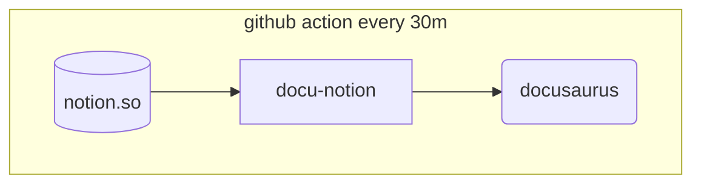

1. I write blog posts in [notion](https://notion.so)
1. Automatically ~15 minutes later the [docusaurus](https://docusaurus.io/) website has pages generated from notion, and pushed to github pages
1. ~~There’s nothing I actually needed to do except write~~

That’s it. I just write. The rest is automated.

### How it works {#1900a1e531c64d3ab4896817eefc7eba}

Source: [https://github.com/dionjwa/dionjwa.github.io](https://github.com/dionjwa/dionjwa.github.io)

A github action runs a few scripts commands:

1. Using [docu-notion](https://github.com/sillsdev/docu-notion) (and a root notion page) the docusaurus blog markdown is generated from specified notion pages
1. The docusaurus website is built
1. Then deployed to github pages

It’s otherwise tricky to find a set of tools for writing/publishing a blog+resume with the following requirements (for me):

- open source, or high data trust
- able to output from notion. I’m too tired to convert to anything, like multiple publishing endpoints. I just want to write, and have everything be automated
- but also look good
- where i just write, and do absolutely nothing else. no saving, no publishing step.
- but also everything is backed up, with full version history
