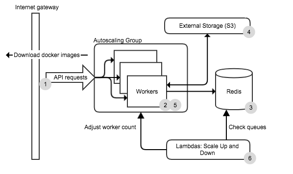
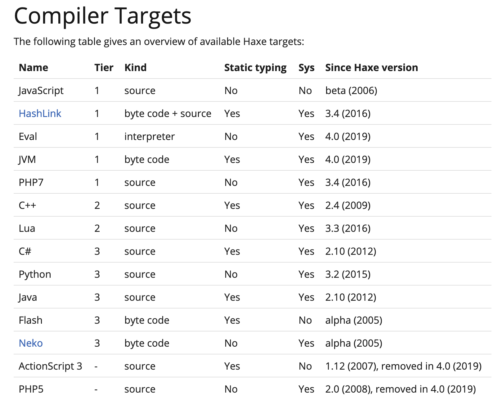
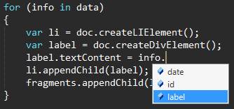

This was in 2017 at Autodesk Bionano (→ Autodesk Lifesciences → `shutdown`), despite the date listed. This is more to record that I have been thinking and building on convenient, easy-access, standardized scalable compute for science for a while.


Apart from the first paragraph, the rest is not applicable anymore, and the system is shelved.


> The [Bionano research group](http://bionano.autodesk.com/) at Autodesk needed an open source tool for performing scalable computes (e.g. molecular simulations) in the cloud. The problem it solves is _"I want to run 1000 simulations and get the results quickly, and I don't have access to a high performance cluster (or I don't know how to use the cluster)"_. We built [cloud-compute-cannon](https://github.com/Autodesk/cloudcomputecannon/) (CCC) for this. This blog describes some of the technology behind it.


### Architecture and technical decisions {#9c785c4f6b12478e978456f62b685acb}


Cloud-compute-cannon is a client/server application. The server is installed on the users cloud (or their local machine) and creates workers to perform compute jobs. The server needs to:

- Install locally and on cloud providers (e.g. AWS or GCE via their SDKs)
- Interact with Docker daemons via the remote API
- Interact with remote machines via SSH
- Talk to a database (that stores state)
- Interact with a thin CLI client
- Potentially other, as yet unknown, requirements

Instead of worker machines pulling jobs from a queue, CCC works by pushing jobs to workers. The disadvantage with this approach is that if the servers goes down, the system stops working. The advantage is that the workers are extremely dumb: they are just bare CoreOS machines with nothing extra installed. Node.js can easily monitor many many workers in case they go down. By making the workers dumb, there is a single place for upgrading the system (simplicity was a goal here).





Node.js was a pretty easy choice for the server because of the large third party library support. Redis was chosen for the database because its simplicity and crucially, it had scripting support. Scripting means no concurrency issues as redis lua scripts block other requests.


The added advantage of Node.js was using the same codebase for the client and server.


However, instead of writing Javascript, it was built in Haxe.


### What is [Haxe](https://haxe.org/#learn-more/)? {#29a6769c7e97428a9ac8af8ed423ea0f}


[Haxe](https://haxe.org/#learn-more/) is an open source language and toolkit. The language is inspired from Javascript and Actionscript (Flash). The Haxe toolkit has _multiple compilers_, meaning you write in one language, and you export directly to multiple languages:


Currently, Haxe compiles to the following targets:





For this project though, we're using just the Javascript compiler. Why Haxe and not e.g. Coffeescript or Typescript (or plain Javascript)? A more detailed answer is provided by [Andy Li](http://blog.onthewings.net/2015/08/05/typescript-vs-haxe/), but in short: Haxe provides far more useful language features, and it is more mature, and has compile time type checking that is invaluable in large code-bases. It has the added bonus that we could build multiple clients in different languages (e.g. Python or native binaries) if needed (the server would be more difficult due to the reliance on third party libraries).


Although Haxe has many [very useful language features](http://haxe.org/manual/lf.html), the features most important to this project are:


### 1) Compile time typing {#efe9c56b642e42e3a9345cc92653e527}


Functions, collections, and variables are _typed_, and checked at compile time. For example, the compiler will prevent you from calling a function with an Int argument when it's expecting an array. For a large-ish codebase of a cloud application this is crucial, as it reduces the number of bugs that make it into functional testing (and functional testing scalable cloud applications is _very_ time consuming).


Javascript code. Note you can call a function with whatever arguments you like:


```javascript
class Foo
{
	constructor() {}

	doAThing(input)
	{
		return [input, input + 5];
	}
}

//Somewhere else:
var foo = new Foo();
var result = foo.doAThing(10); //This is correct
var result2 = foo.doAThing("somestring"); //Legal, although bad.
```


In Haxe, you cannot compile with the last line. The compiler has caught a mistake the developer wrote.


```javascript
//Haxe
class Foo
{
	public function new() {}

	public function doAThing(input :Int) :Array<Int>
	{
		return [input, input + 5];
	}
}
// Somewhere else:
var foo = new Foo();
var result = foo.doAThing(10); //This is correct
var result2 = foo.doAThing("somestring"); //Compile error!

```


### 2) Macros {#856c6b2496904f3195522a9b7bd53c3d}


Haxe macros are incredibly powerful, and the full capabilities are beyond the scope of this blog post. For this project they automatically generate bindings between the CLI client and the server.


On the server, there are 'services' where the methods correspond to RPC (remote procedure calls), where the **@rpc** decorator marks it as a remote API endpoint:


```javascript
class ServiceBatchCompute
{
	//Server method for an API endpoint:
	@rpc({alias: 'jobs', doc: 'List all job ids'})
	public function jobs() :Promise<Array<JobId>>
	{
		return ComputeQueue.getAllJobIds(_redis);
	}
}
```


On the client


```javascript
//Server methods
var defs = Macros.getMethodDefinitions(ServiceBatchCompute);
for(def in defs) {
	CommanderTools.addCommand(program, def);
}
```


The above code generates (at compile time) a function that creates a [JSON-RPC](https://en.wikipedia.org/wiki/JSON-RPC) call to the remote server if the CLI command is called. E.g. calling the CLI client with the **jobs** sub-command:


```shell
ccc jobs
```


creates the following JSON and sends it to the server (via http):


```javascript
{
	jsonrpc:"2.0",
	id: "_",
	method: "jobs",
	params: {}
}
```


The server maps the call to the correct function, calls the function, then sends the result back in the HTTP response. The CLI interacts with the server API, but it could easily be another server.


The important point is that new services have the corresponding CLI client commands _automatically_ generated. There is no need to touch the client code ever again, and there is no chance that a typo will accidentally break client-server communication.


### 3) Code completion {#c82fb9fb390144bca575dfc8f12c6551}


I just really like code completion. Code completion is handled by the Haxe compiler, so all text editors and IDEs can easily add sophisticated code completion.





### 4) Abstracts {#4bb9b6ad68d04f49a1e1d7611abcba8d}


These are classes and data structures that do not exist at run-time, only at compile time. In Cloud-compute-cannon, they are used to maintain specific compile-checked enum types between the server and the database scripts.


The redis scripts are in Lua, which is a new Haxe target! However the Lua target is not yet mature, so the database scripts are written manually, and embedded as raw strings in Haxe classes. This has the advantage of some compile time checking of constants and abstract types.


The following is a [Haxe abstract enum](http://haxe.org/manual/types-abstract-enum.html). It only exists at compile time, at runtime the values are just strings.


```javascript
@:enum
abstract JobStatus(String) from String {
	var Pending = 'pending';
	var Working = 'working';
	var Finalizing = 'finalizing';
	var Finished = 'finished';
}
```


However, the values can be embedded in a Lua script:


```lua
local status = "${JobStatus.Pending}"
```


And this Lua script is embedded in a Haxe class (this example is contrived for simplicity):


```javascript
var script = 'local status = "${JobStatus.Pending}"';
```


Then if we change the JobStatus abstract, all the values are compile time checked. This means that it is impossible for a simple typo in a string value to result in a value being sent between the server and the database.


When the Lua target stabilizes, the scripts may get written in Haxe and compiled. This would allow better code re-use, and allow compile-time checking of the actual types and objects being created, stored, and send from within the database.


### Conclusion {#84f4acf04a7f43eba3481ae98c1cfa96}


This demonstrates some of the power that the Haxe toolkit provides:

- Flexibility: write code for multiple platforms without losing the power of a compiler.
- Future proofing: as new platforms become available, the Haxe toolkit can target them.
- More robust code: compiler prevent simple errors, and make maintenance (e.g. refactoring) of large code bases much easier.
- Performance: function inline may not available on the target platform itself (e.g. Javascript in Node.js).
