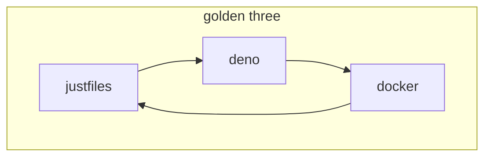

# justfiles are part of the golden three {#91d4820bc6cc4164b589f63c0590793d}





## Just Words of Wisdom (To Myself) {#a660199f26954368939f6ff59ee255ae}


### Always include the full path of commands {#d2d23cebe20b4d158daa8400e3cdf9ac}


If you document something with what &lt;command&gt; you should run, e.g.


```bash
# And then you type: 'just <command>'
```


but you are `</over/here>` but you have to be `</somewhere/else>` then please include the full path so there is never any doubt and you don’t have to go `fd`'ing: `'</be/specific> just <command>'`. It doesn’t have to be this exact formula, but try to remove this kind of friction.

